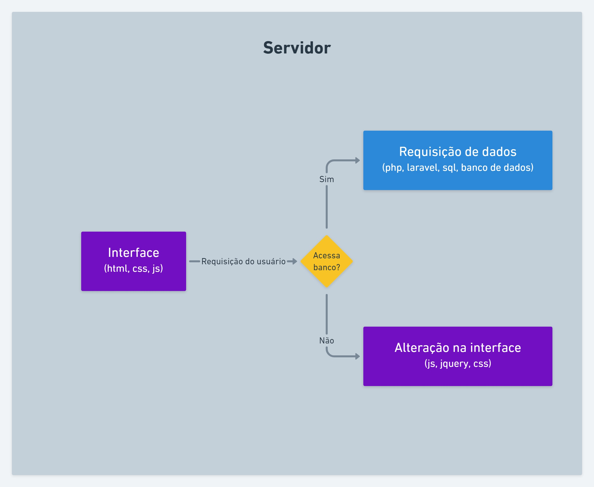

# Arquitetura da Solução

Pré-requisitos: <a href="3-Projeto de Interface.md"> Projeto de Interface</a>

Definição de como o software é estruturado em termos dos componentes que fazem parte da solução e do ambiente de hospedagem da aplicação.

## Diagrama de componentes

Diagrama que permite a modelagem física de um sistema, através da visão dos seus componentes e relacionamentos entre os mesmos.

Exemplo: 

Os componentes que fazem parte da solução são apresentados na Figura XX.

Figura XX - Arquitetura da Solução

A solução implementada conta com os seguintes módulos:
- **Navegador** - Interface básica do sistema  
  - **Páginas Web** - Conjunto de arquivos HTML, CSS, JavaScript e imagens que implementam as funcionalidades do sistema.
   - **Local Storage** - armazenamento mantido no Navegador, onde são implementados bancos de dados baseados em JSON. São eles: 
     - **Usuários** - seções onde são armazenados dados do usuário locado
     - **Instituição** - sessão que armazena a identificação da instituição a qual o usuário logado pertence
     - **Data** - sessão que armazena informações sobre a data atual 
 - **Hospedagem** - local na Internet onde as páginas são mantidas e acessadas pelo navegador. 

> **Links Úteis**:
>
> - [Whimsical](https://whimsical.com/)

Inclua um diagrama da solução e descreva os módulos e as tecnologias que fazem parte da solução. Discorra sobre o diagrama.

A imagem a seguir ilustra a o fluxo do usuário em nossa solução. Assim que o usuário entra na plataforma, ele é apresentado à tela inicial (Tela 1) onde ele é confrontado com um menu de navegação e com informações resumidas sobre o número de cestas em estoque e informações sobre as últimas distribuições.

Caso ele opte por seguir pelo caminho de cadastro de novos alimentos em estoque, ele será redirecionado para a tela de cadastro de estoque (Tela 2), onde pode inserir mais alimentos no estoque. Nessa tela, o usuário pode inserir alimentos um a um ou se preferir, pode inserir em massa, por meio da importação de planilha. Após cadastrar novos alimentos em estoque, o usuário pode selecionar a opção de cadastro de beneficiário e ser direcionado para a tela 3, onde poderá realizar o cadastro de novos beneficiários, grupos familiares e identificar pessoas autorizadas a recolher o benefício dentro do grupo familiar.

Ao selecionar a opção de concessão, ele será enviado para a tela 4, onde poderá liberar o/os benefícios para beneficiário cadastrado anteriormente. Após a liberação do benefício, o usuário será encaminhado para a tela de registro de recebimento, onde deve imprimir um nota de registro que deve ser assinada pelo recebedor do benefício.

## Tecnologias Utilizadas

Para implementar a solução, vamos utilizar as linguagens html, css, javascript, php e sql, juntamente com os frameworks bootstrap, sass e laravel, além de bibliotecas como o jquery. Serviço de hospedagem, git e o github para versionamento, banco de dados sql e o vscode como "IDE".

 

## Hospedagem

Explique como a hospedagem e o lançamento da plataforma foi feita.
**dados insuficientes para preencher essa informação**

> **Links Úteis**:
>
> - [Website com GitHub Pages](https://pages.github.com/)
> - [Programação colaborativa com Repl.it](https://repl.it/)
> - [Getting Started with Heroku](https://devcenter.heroku.com/start)
> - [Publicando Seu Site No Heroku](http://pythonclub.com.br/publicando-seu-hello-world-no-heroku.html)
